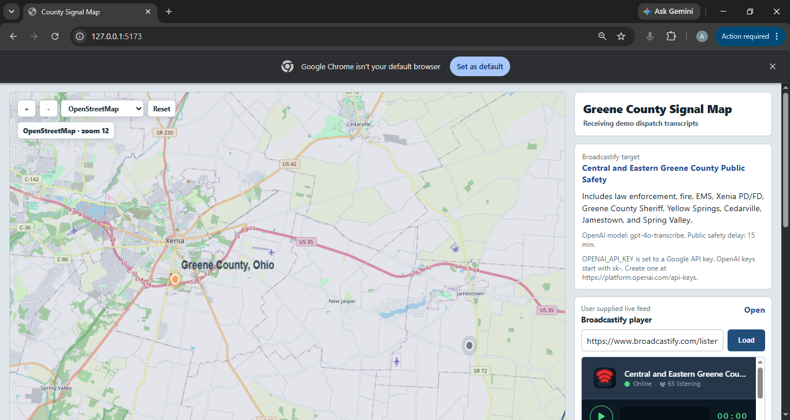
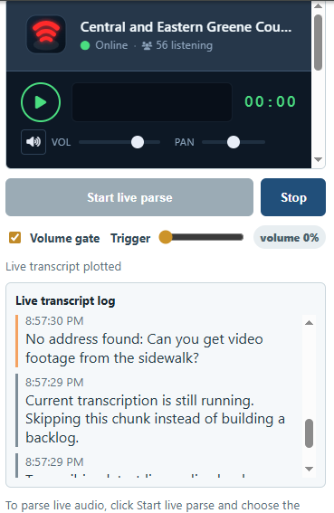
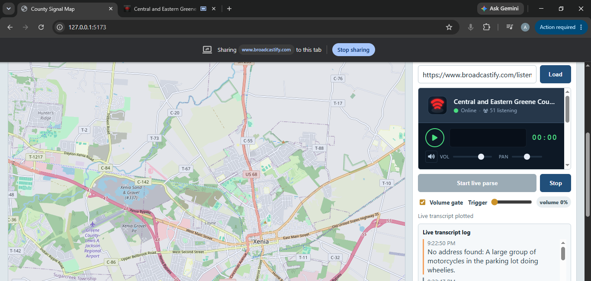

# County Signal Map

Pixi-based public-safety incident mapper for Greene County, Ohio. The app targets the Broadcastify `Central and Eastern Greene County Public Safety` feed listing and provides a compliant ingestion path for licensed/uploaded audio instead of scraping live audio. It parses dispatch-style transcript text for street addresses, geocodes recognized incidents, and plots them on an interactive county map while showing live parser status in the side panel.

## Screenshots

### County signal map

The main map view shows parsed incidents plotted on the Greene County map while the Broadcastify player and live transcript controls remain available in the right-side panel.



### Live Broadcastify player and transcript parser

The app can load the Broadcastify feed page in the side panel and run the live parsing workflow from the same interface.



### Transcript parsing feedback

When the transcript does not contain a usable street address, the parser records the transcript text and reports that no address was found instead of plotting a bad location.



Broadcastify notes:

- Greene County feed: https://www.broadcastify.com/listen/feed/33333
- Greene County page: https://www.broadcastify.com/listen/ctid/2068
- Broadcastify's Live Audio Catalog API is for metadata and archive listings, not live audio streaming.
- Broadcastify states AI/ML use cases require licensing, so this project keeps live ingestion behind explicit licensed/uploaded audio.

OpenAI notes:

- Default transcription model is `gpt-4o-transcribe`.
- Upload route accepts `mp3`, `mp4`, `mpeg`, `mpga`, `m4a`, `wav`, or `webm`, matching the OpenAI speech-to-text file types.
- Set `OPENAI_API_KEY` before using `/api/transcribe-upload`.

## Run

```bash
npm install
npm run dev
```

Open http://127.0.0.1:8787. The server also listens on http://127.0.0.1:5173 for compatibility with older Vite URLs.

## Environment

Copy `.env.example` to `.env` and set values as needed.

```bash
TRANSCRIBE_PROVIDER=openai
OPENAI_API_KEY=sk-...
OPENAI_TRANSCRIBE_MODEL=gpt-4o-transcribe
LOCAL_TRANSCRIBE_MODEL=large-v3-turbo
LOCAL_TRANSCRIBE_DEVICE=auto
LOCAL_TRANSCRIBE_COMPUTE_TYPE=default
LOCAL_TRANSCRIBE_LANGUAGE=en
LOCAL_TRANSCRIBE_PYTHON=python
LOCAL_TRANSCRIBE_TIMEOUT_MS=120000
LOCAL_TRANSCRIBE_LOAD_TIMEOUT_MS=300000
BROADCASTIFY_API_KEY=
COUNTY_PRESET=greene-oh
PUBLIC_SAFETY_DELAY_MINUTES=15
PORT=8787
```

## Local Transcription

For local/offline transcription, switch providers in `.env`:

```bash
TRANSCRIBE_PROVIDER=local
LOCAL_TRANSCRIBE_MODEL=large-v3-turbo
LOCAL_TRANSCRIBE_DEVICE=auto
LOCAL_TRANSCRIBE_COMPUTE_TYPE=default
LOCAL_TRANSCRIBE_LANGUAGE=en
LOCAL_TRANSCRIBE_PYTHON=python
```

Install the Python bridge dependencies:

```bash
python -m pip install -r requirements-local.txt
```

The recommended local default is `large-v3-turbo` through `faster-whisper`. The first run downloads the model to your local Hugging Face cache; later runs reuse it. For maximum accuracy over speed, try `LOCAL_TRANSCRIBE_MODEL=large-v3`.

For live scanner parsing on CPU-only machines, use a smaller model if transcription falls behind:

```bash
LOCAL_TRANSCRIBE_MODEL=small.en
```

## API

- `GET /api/config`: county, feed, and model configuration.
- `GET /api/broadcastify/feed`: approved Broadcastify catalog API lookup for the configured feed when `BROADCASTIFY_API_KEY` is set.
- `GET /api/incidents/stream`: demo SSE transcript stream.
- `POST /api/parse`: parse `{ "transcript": "..." }` for a street address and plotted coordinate.
- `POST /api/transcribe-upload`: upload licensed audio in the `audio` form field, transcribe it, parse addresses, and return a plot-ready incident.

## Next Integration Step

For production, replace the demo SSE source with one of:

- A licensed Broadcastify Calls or archive workflow.
- Your own scanner/audio receiver feed.
- A queue of delayed, pre-authorized public-safety audio clips.

Keep the delay and geocoding precision appropriate for public-safety use.
